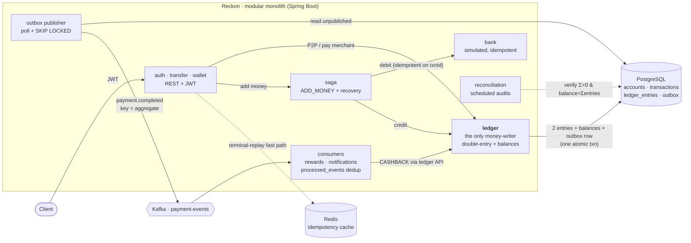

# Reckon


> A double-entry ledger that reckons every paisa.

Reckon is a wallet/payments backend (think the core inside PhonePe / Paytm Wallet) built to be **provably correct under concurrency and failure** — money is never lost or created. It's a study in the hard parts of fintech backends: double-entry ledgers, idempotency, distributed-transaction failure handling, and reconciliation.

## Status — complete

All seven phases of the design are implemented and tested (**63 tests**, Testcontainers with real Postgres / Kafka / Redis):

1. JWT auth + double-entry ledger + atomic, concurrency-safe P2P transfers
2. Stripe-style idempotency — 4-way replay, DB-authoritative with a Redis fast-path
3. Kafka transactional outbox — at-least-once, ordered by aggregate, poison-message → dead-letter
4. Idempotent consumers → exactly-once *effect* (rewards cashback, notifications)
5. ADD_MONEY **saga** over a simulated idempotent bank, with crash/timeout recovery + compensating refund
6. Scheduled **reconciliation** jobs — sum-to-zero, balance integrity, stuck-PENDING
7. k6 load test + pessimistic-vs-optimistic locking **benchmark**

Full design in [`docs/design/specs`](docs/design/specs); staged implementation plans in [`docs/design/plans`](docs/design/plans).

## Architecture



**Key invariants:** money moves only through the ledger; the entry writes and the `payment.completed` outbox row commit in one transaction (no dual-write); Postgres' `unique(initiator_id, idempotency_key)` is the sole double-debit guard; Kafka is at-least-once and consumers dedup for exactly-once *effect*; Redis and every scheduler degrade gracefully (the system is correct without them).

## Engineering highlights

- **Money is conserved, by construction.** Balances are never mutated directly — every movement is two append-only ledger entries (a debit and a credit) that sum to zero. The `balance` column is a *transaction-consistent denormalization* committed atomically with the entries; reconciliation *verifies* `balance == SUM(entries)` rather than maintaining it. Integer paisa everywhere — no floats.
- **The transfer is genuinely atomic.** Lock the two accounts in fixed id order → check funds → write two entries → update balances → flip status, all in one DB transaction. A real Spring gotcha surfaced here: a `@Transactional` method called on the same bean bypasses the proxy and silently runs in auto-commit. Reckon routes the transactional body through a separate bean (`TransferExecutor`) so the proxy actually engages.
- **Deadlock-safe under load.** Concurrent transfers acquire row locks in a fixed order; `SELECT ... FOR NO KEY UPDATE` is used (not `FOR UPDATE`) so writer locks don't conflict with the `FOR KEY SHARE` locks Postgres takes for the `ledger_entries → accounts` foreign key — eliminating a real deadlock while preserving writer exclusion.
- **Correctness is proven, not asserted.** Tests include 200 concurrent same-account debits (never overdraws, money conserved, no orphaned entries) and bidirectional A→B / B→A transfers that actually exercise the lock ordering. Failures are persisted in their own `REQUIRES_NEW` transaction so a rolled-back transfer still leaves a legible `FAILED` record.
- **Idempotency is DB-authoritative with a Redis fast-path.** The `unique(initiator_id, idempotency_key)` constraint in Postgres is the ONLY race guard against double-debits — no amount of Redis failure can cause a double-spend. Redis caches only immutable **terminal** results (COMPLETED/FAILED), never in-flight PENDING, so a stale or missing cache entry never produces a wrong answer. On a cache hit the result is served without touching Postgres; on Redis failure the system degrades transparently to the DB-only path. The fast-path is gated by `reckon.idempotency.cache.enabled`; all 60 pre-Redis tests run with the cache disabled, proving idempotency works without Redis.

## Tech stack

Kotlin · Spring Boot 3.3 · PostgreSQL · Apache Kafka · Redis (idempotency fast-path) · Flyway · Gradle · JUnit 5 · Testcontainers · k6

## Running it

```bash
# Postgres for local runs
docker compose up -d

# Full test suite (uses Testcontainers — Docker must be running)
./gradlew test

# Run the app
./gradlew bootRun
```

### API

```
POST /auth/signup       { email, password }                              -> { token }
POST /auth/login        { email, password }                              -> { token }
POST /transfers/p2p     { idempotencyKey, toUserId, amountPaisa }         (Bearer)
POST /wallet/add-money  { idempotencyKey, bankRef, amountPaisa }          (Bearer)  -- saga
```

## Load testing & benchmark

### JVM locking benchmark (captured, both strategies correct)

`LockingBenchmarkTest` runs an identical hot-account workload through both the pessimistic and optimistic strategies, then **asserts correctness for both**: money is conserved across the hot set AND every account's `balance == seedBalance + sum(entries)`.

```
=== LOCKING BENCHMARK (200 transfers, 8 threads, hot 8-account set) ===
pessimistic: 307ms   651 tps  ok=200
optimistic : 1343ms  149 tps  ok=199  avgAttempts=2.89
```

> Note: these throughput numbers are indicative and host-dependent — they vary by machine (CPU, disk, JVM warmup, etc.).

**Trade-off:** The pessimistic strategy (FOR NO KEY UPDATE) serializes writers on each row, giving stable throughput under load with zero retries. The optimistic strategy (version CAS + bounded retry) avoids row locks but spends time on retries under contention (2.89 attempts per successful transfer on an 8-account hot set). For a typical wallet, where each user's transfers serialize naturally on their own row, the contention profile is far lower than the benchmark hot set. The hot-account serialization bottleneck (e.g. a popular merchant or top-up system account) is a known limitation — entry sharding (multiple sub-accounts summed by reconciliation) is the standard mitigation and is deferred as future work.

### k6 HTTP load test (run on this machine)

Run with 10 VUs for 20s against the real app (Spring Boot + Postgres + Kafka via docker-compose):

```
http_req_duration  avg=14.16ms  p(95)=40.96ms  max=917ms
http_req_failed    0.00%  (0 out of 2065 requests)
http_reqs          2065 total  (~97 req/s)
checks_succeeded   100.00% (2063/2063)
  - funded sender:       ✓
  - transfer ok or 4xx:  ✓
  - duplicate replay ok: ✓
```

All HTTP thresholds passed: `p(95) < 800ms` and `failure rate < 5%`.

**Post-run reconciliation (zero inconsistencies):**

```
unbalanced_txns=0  balance_drifts=0
RECONCILIATION CLEAN
```

Zero unbalanced transactions (every completed txn has a zero-sum entry pair) and zero balance drift (every `accounts.balance` equals the ledger sum) — confirming no double-debits, no money creation, and no orphaned entries under concurrent load with deliberate duplicate-key retries.

To run it yourself: `./loadtest/run.sh` (requires Docker + k6).

## Design docs

The full design — including the failure-mode reasoning behind idempotency replay, the system-account sign convention, the outbox delivery guarantees, and the recovery-vs-slow-request race — lives in [`docs/design/specs`](docs/design/specs) and the staged implementation plan in [`docs/design/plans`](docs/design/plans).

## Property-based invariant testing

Plan 10 adds `LedgerInvariantPropertyTest`, which proves the core ledger invariants hold not just for hand-picked scenarios but under **arbitrary sequences of mixed operations**.

For each of five fixed seeds, the test:
1. Creates 5 fresh accounts and funds them via the `AddMoneyService` saga (so `balance == SUM(entries)` is established from the start).
2. Fires 120 random operations — P2P transfers, authorize, capture (full or partial), and void — absorbing expected failures (INSUFFICIENT_FUNDS, INSUFFICIENT_AVAILABLE, stale holds) in try/catch.
3. Asserts the three invariants **scoped to the run's own accounts**:
   - `balance == SUM(signed ledger entries)` — double-entry consistency.
   - `reserved_balance == SUM(amount of still-HELD holds for that account)` — reservation bookkeeping.
   - No user wallet ever goes negative (`balance ≥ 0`, `reserved_balance ≥ 0`).

**Why seeded-random-in-Spring-`@Test` instead of jqwik:** jqwik's `@Property` runs on the JUnit Platform but not as a Jupiter `@Test`, so Spring's `SpringExtension` does not `@Autowired`-inject beans or wire Testcontainers into property methods. Seeded `kotlin.random.Random` inside a standard `@Test` gives the same value — deterministic, reproducible, DB-integrated — without any framework friction.

## Two-phase payments (hold → capture)

Plan 9 adds card/UPI-style two-phase payments backed by `accounts.reserved_balance` and a `holds` table.

**Money model:** `available = balance − reserved`. The double-entry invariant `balance == SUM(ledger_entries)` is **preserved** — holds write **no** ledger entries; only captures do.

| Operation | Effect |
|-----------|--------|
| **Authorize** | Locks payer row; asserts `available ≥ amount`; `reserved += amount`; inserts HELD hold. No money moves, no ledger entries. |
| **Capture (full)** | `reserved −= holdAmount`; transfers `holdAmount` payer → payee via `TransferExecutor` (2 ledger entries, balances updated); hold → CAPTURED. |
| **Capture (partial, captureAmount < holdAmount)** | `reserved −= holdAmount`; transfers only `captureAmount`; `holdAmount − captureAmount` returns silently to available. |
| **Void / Expiry** | `reserved −= holdAmount`; hold → VOIDED / EXPIRED. Nothing moves. |

**Invariants enforced:**
- `reserved_balance ≥ 0` (DB CHECK constraint)
- Concurrent authorizes never over-reserve (`reserveIfAvailable` uses a WHERE guard: `balance − reserved ≥ amount`)
- Idempotent authorize: select-before-insert pattern (no aborted-txn problem from DuplicateKeyException)
- Status transitions guarded: `markCaptured` / `markClosed` use `WHERE status='HELD'`; rowcount 0 → throw

**Expiry job:** `HoldExpiryService.expireDue` iterates expired holds and calls `HoldExpiryWorker.expireOne` cross-bean — the separate-bean pattern ensures `@Transactional` engages via the Spring proxy (avoids self-invocation trap). Disabled in tests via `reckon.holds.expiry.enabled=false`.

**Reconciliation:** `ReconciliationService.run()` now also audits `reserved_balance == SUM(outstanding HELD hold amounts)` per account (reports `reservedDrifts`).

### Endpoints

```
POST /payments/authorize          { idempotencyKey, toUserId, amountPaisa, ttlSeconds }
POST /payments/{holdId}/capture   { amountPaisa? }    -- null = full capture
POST /payments/{holdId}/void
```

## Chaos testing (Plan 11)

`TransferChaosTest` and `SagaChaosTest` use [Toxiproxy](https://github.com/Shopify/toxiproxy) to inject network faults between the app and PostgreSQL and then assert that money invariants hold.

**Architecture:** A `ToxiproxyContainer` and a `PostgreSQLContainer` share a Docker `Network`. Spring's datasource URL points at the Toxiproxy mapped port, not Postgres directly. Flyway runs through the proxy at context startup with no toxics active. Tests add toxics via `ChaosTestBase.pgProxy` and remove them in `@AfterEach`.

**Why Postgres, not Kafka:** The core money guarantees live in Postgres transactions. Proxying Postgres lets us prove the strongest property — **atomicity under connection failure**. Kafka advertised-listener proxying is unreliable (Kafka clients reconnect directly, bypassing the proxy).

**Invariants verified under chaos:**

| Invariant | Test |
|-----------|------|
| `balance(a) == seed(a) + SUM(ledger_entries)` | `TransferChaosTest` — both transfer tests |
| Money conserved: `balance(a) + balance(b) == 1,000,000` | atomicity test |
| `balance(b) == 1000 × successCount` — every transfer all-or-nothing | atomicity test |
| Every wallet ends `0` or `50,000` (never partial) | `SagaChaosTest` |
| Reconciliation clean (no balance drift for chaos wallets) | `SagaChaosTest` |

**Faults injected:**
- **Latency toxic** (`+200 ms downstream`): transfers must still succeed and stay consistent.
- **`resetPeer` toxic** (cuts connections after ~100–120 ms): Postgres rolls back any mid-flight transaction; the app catches the exception and counts it failed; no partial debit/credit survives.

---

## Observability (Plan 12)

Reckon ships with production-grade observability: Prometheus metrics, OpenTelemetry distributed tracing, and correlation IDs threaded through every log line.

### Custom Prometheus metrics

| Metric | Type | Labels | Description |
|--------|------|--------|-------------|
| `reckon_transfers_total` | Counter | `type`, `outcome` | Every call to `recordTransfer`, tagged with outcome: `COMPLETED`, `REPLAYED`, `FAILED` |
| `reckon_transfer_duration_seconds` | Histogram | — | End-to-end duration of each transfer; publishes p50, p95, p99 percentiles |

Exposed at `/actuator/prometheus` (no authentication required — safe for Prometheus scraping).

Verification in tests: `MetricsTest` does a real transfer, then asserts the counter is `>= 1.0` in the registry AND that `reckon_transfers` and `reckon_transfer_duration` appear in the raw Prometheus text at `/actuator/prometheus`.

### Distributed tracing (OpenTelemetry)

Each call to `LedgerService.recordTransfer` is wrapped in a Micrometer tracing span named `reckon.transfer`, tagged with `type` (P2P, ADD_MONEY, CASHBACK, …). Spans are exported via OTLP.

**Configuration:**
- Sampling: 100% (`management.tracing.sampling.probability=1.0`)
- OTLP endpoint: `OTEL_EXPORTER_OTLP_ENDPOINT` env var (empty → no export; collector not required)
- In tests/local dev: no collector needed — context loads and tracing no-ops cleanly

`TracingTest` verifies the `Tracer` bean is auto-configured and that a full transfer runs cleanly within a span without throwing.

### Correlation IDs

Every HTTP request gets a correlation ID:
- If `X-Correlation-Id` is present in the request headers, that value is used
- Otherwise, a UUID is generated
- The ID is set in MDC (`correlationId`) so it appears in every log line for the request
- The ID is echoed back in the `X-Correlation-Id` response header

Log pattern (via `logback-spring.xml`):
```
HH:mm:ss.SSS LEVEL [corr=<id> trace=<traceId> span=<spanId>] logger - message
```

`CorrelationIdFilterTest` verifies both the echo-back and the generation cases.

### Running the Prometheus + Grafana stack

```bash
# 1. Start the app on port 8080 (default)
./gradlew bootRun

# 2. In another terminal, start Prometheus + Grafana
docker compose -f observability/docker-compose.observability.yml up

# 3. Open Grafana at http://localhost:3000
#    (anonymous access, no login required)
#    The "Reckon — Wallet Observability" dashboard is pre-loaded.

# 4. Prometheus UI at http://localhost:9090
#    Query: reckon_transfers_total
```

The Grafana dashboard (`observability/grafana-dashboard-reckon.json`) includes four panels:
- **Transfer Rate** — `rate(reckon_transfers_total[1m])` by outcome
- **Transfer Latency** — p50 / p95 / p99 from the histogram
- **JVM Heap Memory** — used vs max
- **Transfer Volume (1h)** — cumulative by outcome

> Screenshot: add after running locally with real traffic.
